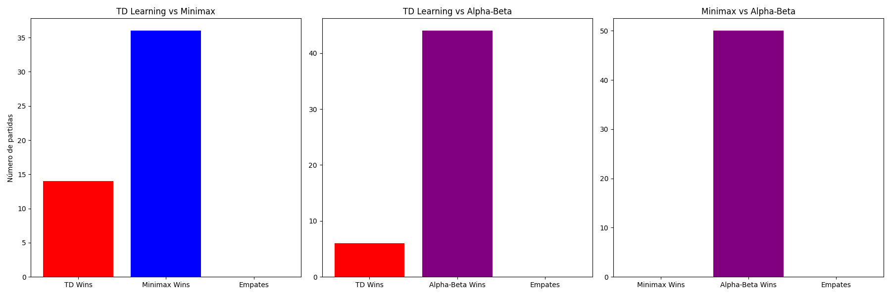

# LAB7-IA
# Aprendizaje por TD Learning en Connect Four

* [Enlace al repositorio](https://github.com/FabianKel/LAB7-IA)

* [Enlace al video de demostración](https://youtu.be/qCpKukzBzZQ)


## Integrantes del equipo
- [Mónica Salvatierra - 22249](https://github.com/alee2602)
- [Paula Barillas - 22764](https://github.com/paulabaal12)
- [Derek Arreaga - 22537](https://github.com/FabianKel) 

## Descripción del Laboratorio
Este laboratorio implementa un agente basado en aprendizaje por diferencias temporales (TD Learning) para el juego Connect Four. Su desempeño se evalúa en comparación con un agente basado en Minimax y otro con poda Alpha-Beta.

## Requisitos
- Python 3.x
- Bibliotecas necesarias:
  - `numpy`
  - `matplotlib`
  - `tensorflow` (opcional, para utilizar una red neuronal en la función de valor)

# Agente TD para Conecta 4

Este proyecto implementa un agente de Aprendizaje por Diferencias Temporales (TD Learning) para jugar Conecta 4. Utiliza una tabla de valores Q para mejorar su rendimiento a través de la experiencia.

## Características del Agente
- **Exploración y Explotación**: Implementa una política epsilon-greedy.
- **Aprendizaje Temporal Diferenciado**: Ajusta los valores Q basándose en la ecuación de actualización de TD Learning.
- **Simulación de Movimientos**: Evalúa el impacto de sus acciones en el tablero.
- **Oponente Minimax**: Se entrena jugando contra un agente basado en Minimax.
- **Persistencia de Valores Q**: Guarda y carga modelos entrenados usando `pickle`.

## Requisitos
- Python 3.x
- NumPy

## Uso

### Entrenamiento del Agente
```python
from td_agent import TDAgent

agente = TDAgent(player_id=1)
agente.aprender(episodios=10000)
agente.guardar_modelo("modelo_q.pkl")
```

### Cargar un Modelo Entrenado
```python
agente = TDAgent(player_id=1, load_file="modelo_q.pkl")
```

### Jugar con el Agente
```python
estado_actual = [[0 for _ in range(7)] for _ in range(6)]
movimiento = agente.elegir_movimiento(estado_actual)
print(f"El agente juega en la columna: {movimiento}")
```

## Explicación del Código

### `estado_a_clave(tablero)`
Convierte el estado del tablero en una clave hashable para la tabla de valores Q.

### `movimientos_validos(tablero)`
Devuelve una lista de columnas en las que es posible realizar un movimiento.

### `calcular_recompensa(tablero, accion, player_id)`
Calcula la recompensa de un movimiento basándose en la victoria, derrota o control del centro.

### `elegir_movimiento(tablero)`
Elige la mejor acción disponible usando una política epsilon-greedy.

### `actualizar_q(estado, accion, recompensa, nuevo_estado)`
Aplica la ecuación de aprendizaje TD para actualizar los valores Q.

## Entrenamiento
Durante el entrenamiento, el agente juega contra un oponente Minimax con profundidad 3. Se ajusta el valor de `epsilon` progresivamente para reducir la exploración y favorecer la explotación de conocimiento adquirido.

## Guardado y Carga del Modelo
El modelo de valores Q puede guardarse en un archivo usando:
```python
agente.guardar_modelo("modelo_q.pkl")
```
Y cargarlo posteriormente con:
```python
agente = TDAgent(player_id=1, load_file="modelo_q.pkl")
```

## Evaluación y Pruebas
Se realizaron **150 juegos** para evaluar el rendimiento del agente:
- **50 juegos** contra el agente Minimax
- **50 juegos** contra Minimax con poda Alpha-Beta
- **50 juegos** jugando contra sí mismo

Los resultados se representaron gráficamente para analizar la cantidad de victorias de cada agente.



## Video de Demostración
El video de demostración muestra 3 partidas aceleradas:
1. TD Learning vs. Minimax
2. TD Learning vs. Minimax con poda Alpha-Beta
3. TD Learning vs. sí mismo


### Referencias
* La implementación del juego de Connect 4 con turtle es extraído del repositorio [FabianKel/connect4-python](https://github.com/FabianKel/connect4-python) de [Derek Arreaga](https://github.com/FabianKel).